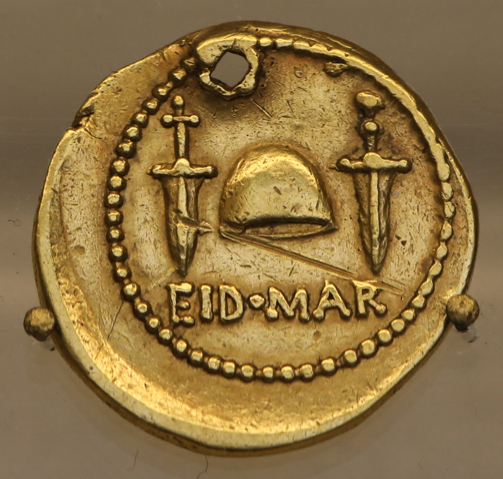

# 🏛️ Ancient Coins Collection Tracker

A full-stack Progressive Web App for tracking your ancient and modern coin collection. Built with **Go** (Gin), **Vue 3** (TypeScript), **SQLite**, and **Ollama** AI vision integration.



## Features

- 📋 **Full Collection Management** — Track coins with detailed metadata: denomination, ruler, era, mint, material, grade, inscriptions, RIC rarity ratings, and more
- 📸 **Obverse & Reverse Photos** — Upload and view coin images with a gallery viewer
- 🤖 **AI-Powered Analysis** — Send coin photos to Ollama (llava/llama3.2-vision) for expert numismatic analysis
- 🏷️ **Category Filtering** — Browse by Roman, Greek, Byzantine, Modern, or search across all fields
- 🔍 **Full-Text Search** — Search by name, ruler, inscription, denomination, or any text field
- ⭐ **Wishlist** — Track coins you're looking for
- 📊 **Collection Statistics** — Value summaries, category/material breakdowns, ROI tracking
- 📱 **Progressive Web App** — Install on mobile or desktop, works offline
- 🌙 **Dark Museum Theme** — Elegant dark UI with antique gold/bronze accents
- 🔐 **JWT Authentication** — Secure multi-user support

## Tech Stack

| Layer | Technology |
|-------|-----------|
| Backend | Go 1.22+, Gin, GORM |
| Frontend | Vue 3, TypeScript, Vite, Pinia |
| Database | SQLite |
| AI | Ollama (llava vision model) |
| Auth | JWT (golang-jwt), bcrypt |
| PWA | vite-plugin-pwa, Workbox |

## Quick Start

### Prerequisites
- Go 1.22+
- Node.js 20+
- [Task](https://taskfile.dev/) (optional but recommended)
- [Ollama](https://ollama.ai/) (optional, for AI analysis)

### Development

```bash
# Clone and enter directory
cd AncientCoins

# Run both API and frontend
task run

# Or separately:
task run-api    # Go API on :8080
task run-web    # Vite dev server on :5173
```

### Docker

```bash
# Generate .env file
task init

# Build and run
task docker-build
task docker-run

# Or use docker-compose
docker compose up -d
```

The app will be available at `http://localhost:8080`.

### First-Time Setup

1. Navigate to the app
2. Register your first account (automatically becomes admin)
3. Start adding coins to your collection!

## AI Coin Analysis

To use the AI analysis feature:

1. Install [Ollama](https://ollama.ai/)
2. Pull a vision model: `ollama pull llava`
3. Start Ollama: `ollama serve`
4. Upload coin images and click "Analyze with AI" on the coin detail page

The AI will identify the coin, describe obverse/reverse designs, assess condition, read inscriptions, and provide historical context.

## Project Structure

```
AncientCoins/
├── src/
│   ├── api/           # Go backend
│   │   ├── main.go
│   │   ├── config/    # Configuration
│   │   ├── models/    # GORM models
│   │   ├── handlers/  # HTTP handlers
│   │   ├── middleware/ # JWT auth middleware
│   │   ├── services/  # Ollama service
│   │   └── database/  # SQLite connection
│   └── web/           # Vue 3 frontend
│       └── src/
│           ├── api/        # API client
│           ├── components/ # Reusable components
│           ├── pages/      # Route pages
│           ├── stores/     # Pinia stores
│           └── types/      # TypeScript types
├── Dockerfile              # Multi-stage build
├── docker-compose.yaml
├── Taskfile.yml
└── .devcontainer/          # Dev container config
```

## License

MIT
